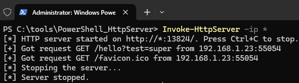
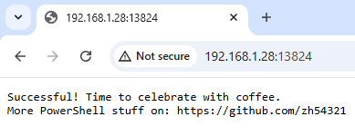

# Invoke-HttpServer

## Description
The `Invoke-HttpServer` function starts an HTTP server that listens for incoming requests on a specified IP and port. It processes requests in a separate runspace and provides request details in the console. The answer served to the client can be customized. The server can be configured for different IP addresses, ports, and timeout durations. It runs in a loop until the specified timeout is reached or it is manually stopped (Ctrl+C). The server has built-in error handling to handle common issues like conflicting ports and access permissions.


## Features
- Start an HTTP server on a specified IP and port.
- Process incoming HTTP requests in a separate runspace.
- Handle requests and output request information to the console.
- Can be stopped using Ctrl+C
- Configurable timeout and listening IP/port.
- Graceful handling of errors such as port conflicts and access restrictions.

## Images
Starting the HTTP Server and listening. After 2 request the server is manually stopped using CTRL+C:



Response in the browser:



## Usage

### Installation

1. Clone the repository:
    ```powershell
   git clone https://github.com/zh54321/PowerShell_HttpServer.git
   ```
2. Import the module before usage:
   ```powershell
   Import-Module ./PowerShell_HttpServer/PowerShellHttpServer.psm1
   ```
   
### Parameters

- `-Port` (optional): The port number on which the HTTP server listens. Default is `13824`.
- `-Ip` (optional): The IP address on which the HTTP server listens. Default is `localhost`.
- `-HttpTimeout` (optional): The duration in seconds for which the HTTP server will run before shutting down automatically. Set to `0` to run indefinitely (Default).

### Examples

#### Example 1: Start an HTTP server with default settings (localhost, port 13824, and a timeout of 60 seconds)
```powershell
Invoke-HttpServer
```
This will start an HTTP server on IP `localhost` and port `13824`. The server will run for 60 seconds before shutting down.

#### Example 2: Start an HTTP server on port 8080 with a timeout of 120 seconds and listening on all interfaces
```powershell
Invoke-HttpServer -Port 8080 -HttpTimeout 120 -Ip "*"
```
This will start an HTTP server on all interfaces and port `8080`. The server will run for 120 seconds before shutting down automatically.
Note: To expose the server in the local network, the command has to be executed as admin.

### Notes

- To stop the server manually, press `Ctrl+C`.
